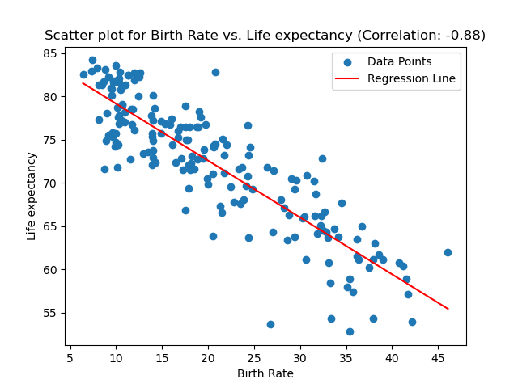
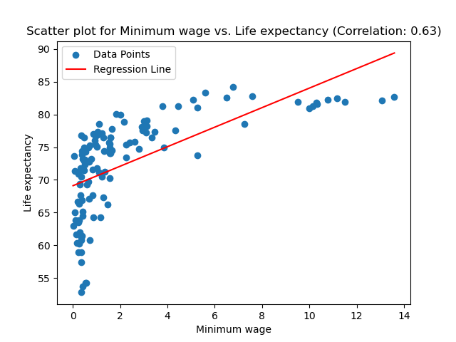
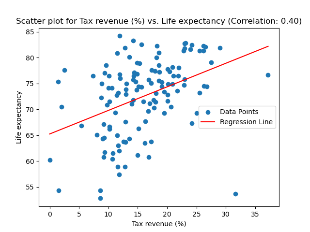
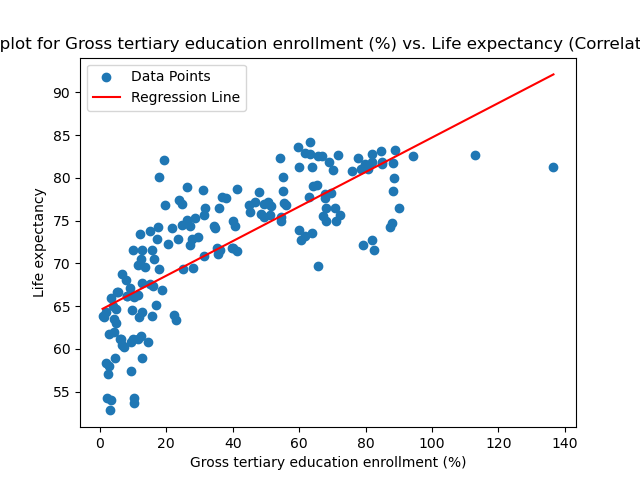
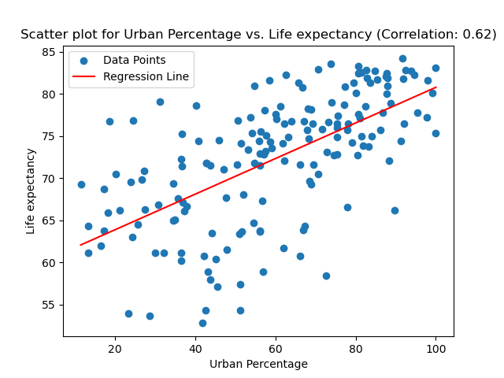
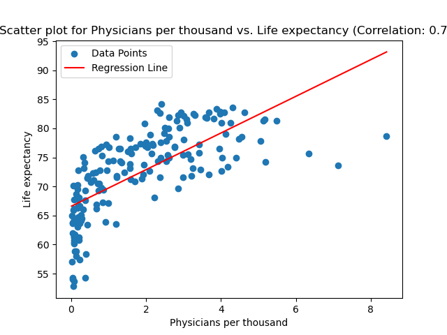
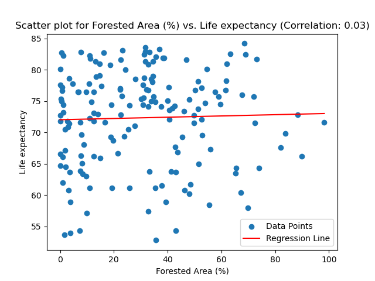
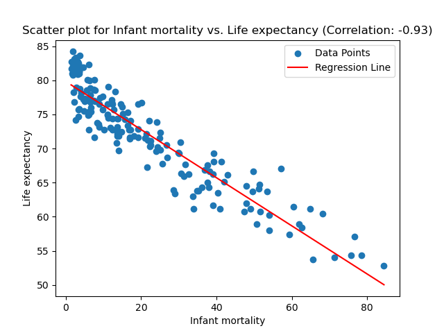

# Global Life Expectancy Investigation

## Project Description/Outline:
Using information from the Global Country Information Dataset 2023, we performed an investigation on average life expectancy.  In addition to getting an overall picture of life expectancy around the world, both linear regression and logistic regression models were created.  The linear regression models revealed the strength of each individual variable's relationship with life expectancy (more details on this follow in the analysis sections).  The logistic regression models were created, trained, tested and compared to see which (if any) of the following categories of variables proved to be a better predictor of a country's average life expectancy:

- Health(Medical) Factors:
    - Birth Rate 
    - Fertility Rate
    - Infant Mortality
    - Maternal Mortality Ratio 
    - Physicians per Thousand
- Financial(Economic) Factors:
    - CPI 
    - CPI Change(%) 
    - Gasoline Price
    - GDP
    - Minimum Wage
    - Population: Labor force participation (%) 
    - Total Tax Rate
    - Unemployment rate
- Living Conditions(Other) Factors:
    - Density (P/Km2)
    - Agricultural Land (%)
    - Armed Forces Size
    - CO2 Emissions
    - Forested Area (%)
    - Gross Primary Education Enrollment (%)
    - Gross Tertiary Education Enrollment (%)
    - Latitude 
    - Longitude
    - Urban Percentage

Analyses of these models can be found in the "General Analysis" section of this file.
## Repository Contents:
- Resources Folder: Includes the SQL Query and both original and cleaned csv files used.
- Tableau Images Project 4 Folder: Includes the four visualizations created by using Tableau.
- Visualizations Folder: Includes the nine scatteplot visualizations created by using Linear Regression models and Matplotlib.
- data_clean.iypnb: Main code that includes Data cleaning the original dataset, data visualization, Linear Regression, SQL.

## Notes & Resources: 
- The database used from Kaggle, https://www.kaggle.com/datasets/nelgiriyewithana/countries-of-the-world-2023, "Global Country Information Dataset 2023"
### This comprehensive dataset provides a wealth of information about all countries worldwide, covering a wide range of indicators and attributes. It encompasses demographic statistics, economic indicators, environmental factors, healthcare metrics, education statistics, and much more. With every country represented, this dataset offers a complete global perspective on various aspects of nations, enabling in-depth analyses and cross-country comparisons.

## Visualizations & Analysis:

## General Analysis:

## Team: 
- Muntasir Billah, Natalie Lollin, Riddhi Sodagar, Azriel Tamayo

## Link to Presentation: 
- https://docs.google.com/presentation/d/1-AS5jVkUymjqZkCW5dJWxZ-dBhG52wBXKvWBQ8ksPeo/edit?usp=sharing

## Link to Tableau Public Workbook: 
- https://public.tableau.com/app/profile/riddhi.sodagar/viz/GlobalLifeExpentancyInvestigation/GrossTertiaryEducation?publish=yes
