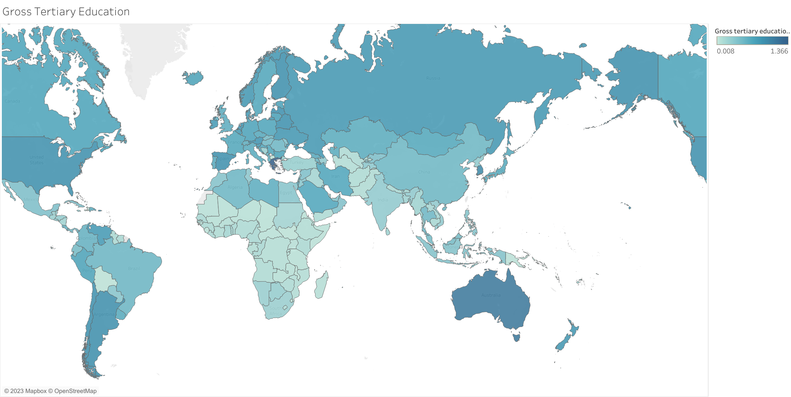
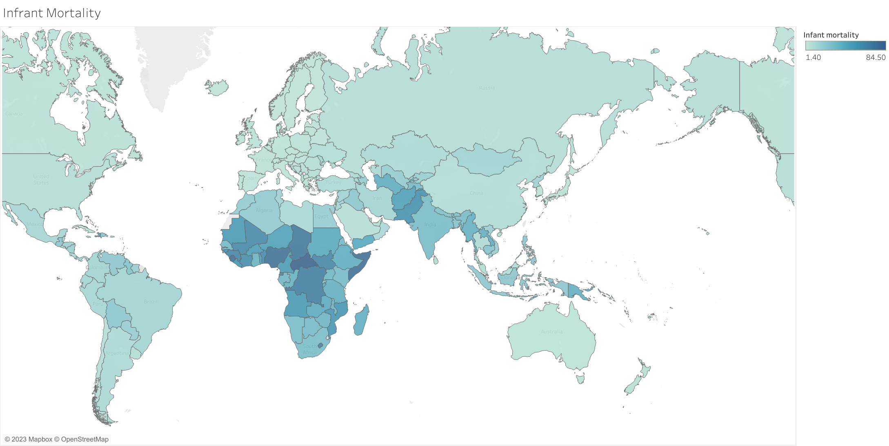
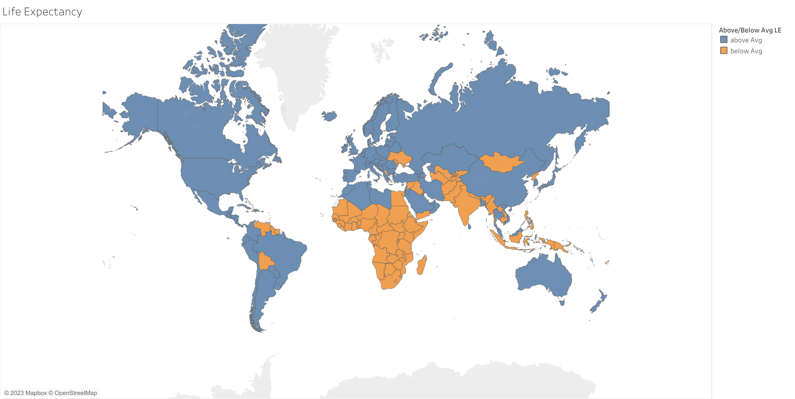
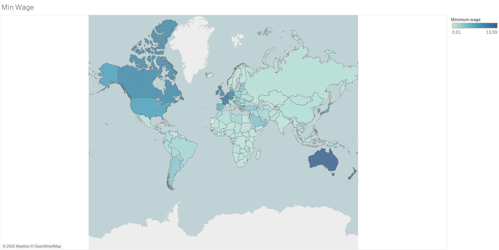

# Global Life Expectancy Investigation

## Project Description/Outline:
Using information from the Global Country Information Dataset 2023, we performed an investigation on average life expectancy.  In addition to getting an overall picture of life expectancy around the world, both linear regression and logistic regression models were created.  The linear regression models revealed the strength of each individual variable's relationship with life expectancy (more details on this follow in the analysis sections).  The logistic regression models were created, trained, tested and compared to see which (if any) of the following categories of variables proved to be a better predictor of a country's average life expectancy:

- Health(Medical) Factors:
    - Birth Rate 
    - Fertility Rate
    - Infant Mortality
    - Maternal Mortality Ratio 
    - Physicians per Thousand
- Financial(Economic) Factors:
    - CPI 
    - CPI Change(%) 
    - Gasoline Price
    - GDP
    - Minimum Wage
    - Population: Labor force participation (%) 
    - Total Tax Rate
    - Unemployment rate
- Living Conditions(Other) Factors:
    - Density (P/Km2)
    - Agricultural Land (%)
    - Armed Forces Size
    - CO2 Emissions
    - Forested Area (%)
    - Gross Primary Education Enrollment (%)
    - Gross Tertiary Education Enrollment (%)
    - Latitude 
    - Longitude
    - Urban Percentage

Analyses of these models can be found in the "General Analysis" section of this file.
## Repository Contents:
- Resources Folder: Includes the SQL Query and both original and cleaned csv files used.
- Tableau Images Project 4 Folder: Includes the four visualizations created by using Tableau.
- Visualizations Folder: Includes the nine scatteplot visualizations created by using Linear Regression models and Matplotlib.
- data_clean.iypnb: Main code that includes Data cleaning the original dataset, data visualization, Linear Regression, SQL.

## Notes & Resources: 
- The database used from Kaggle, https://www.kaggle.com/datasets/nelgiriyewithana/countries-of-the-world-2023, "Global Country Information Dataset 2023"
### This comprehensive dataset provides a wealth of information about all countries worldwide, covering a wide range of indicators and attributes. It encompasses demographic statistics, economic indicators, environmental factors, healthcare metrics, education statistics, and much more. With every country represented, this dataset offers a complete global perspective on various aspects of nations, enabling in-depth analyses and cross-country comparisons.

## Visualizations: 

Two types of visualizations were created.
- Scatter plots created in Python (sample included below)
    - Within each category the strongest two correlations were identified along with the weakest correlation.  Scatter plots were generated for those three variables in each category, creating a total of 9 scatter plots.  

- Filled Maps created in Tableau (sample included below)
    - Map displaying if a country's average life expectancy was above or below the global average
    - For each category (health, financial, conditions) a map was created that displayed the variable that had the strongest correlation to life expectancy on a color spectrum.  The variables from each category were as follows:

        - Health: Infant Mortality
        - Financial: Minimum Wage
        - Gross Tertiary Education Enrollment

## General Analysis:

### Analysis of Scatter Plots:

For each category, the strongest correlations were as follows:
- Health: Infant Mortality (r = -0.93) & Birth Rate (r = -0.88)
- Financial: Minimum Wage(r = 0.63) & Tax Revenue (%) (r = 0.40)
- Conditions: Gross Tertiary Education Enrollment (%) (r = 0.77) & Urban Percentage (r = 0.62)

For each category, the weakest correlations were as follows:
- Health: Physicians per thousand (r = 0.70)
- Financial: Unemployment Rate (r = 0.04)
- Conditions: Forested Area (%) (r = 0.03)

  As demonstrated by the correlation coefficients, infant mortality and birth rate had the strongest association with a country's average life expectancy, both of which had rather strong, negative relationships.  As they increased, average life expectancy tended to decrease.  The only other relationship that was moderately strong (outside of the health category) was gross tertiary education enrollment (%) (from the conditions category).  It is worth noting that every variable in the health category had a strong/moderately strong correlation with life expectancy; this is evident from the fact that the weakest correlation from the health category (physicias per thousand) had a correlation coefficient of 0.70 which was higher than everything outside of the health category with the exception of gross tertiary education enrollment meaning every other measure in the health category had an even stronger relationship (regardless of whether that correlation was positive or negative).  Additionally, there were some variables in the financial and conditions categories that had essentially no linear relationhip with average life expectancy (evidenced by correlation coefficients that were approximately zero.  The strength of the relationship between the health variables and life expectancy carries through in other aspects of this analysis as well.

### Analysis of Maps: 

The initial map created shows which countries have an averages life expecancy above the global average (shown in blue) vs. at/below the global average (shown in orange).  With some exceptions, the largest cluster of countries that had a below average life expectancy were concentrated in central/southern Africa.  In looking at the other maps that were created, we looked at the similarities in the colorations between those maps and this original life expectancy map.  Each map can be found in the Tableau_Images_Project_4 folder, but the similarities between patterns in the Life Expectancy Map and the Infant Mortality Map were most noticeable.  This further supported the observations derived from the scatter plots suggesting the variables from the health category had the strongest relationship with average life expectancy.

### Analysis of Logistic Regression Models: 

## Team: 
- Muntasir Billah, Natalie Lollin, Riddhi Sodagar, Azriel Tamayo

## Link to Presentation: 
- https://docs.google.com/presentation/d/1-AS5jVkUymjqZkCW5dJWxZ-dBhG52wBXKvWBQ8ksPeo/edit?usp=sharing

## Link to Tableau Public Workbook: 
- https://public.tableau.com/app/profile/riddhi.sodagar/viz/GlobalLifeExpentancyInvestigation/GrossTertiaryEducation?publish=yes
